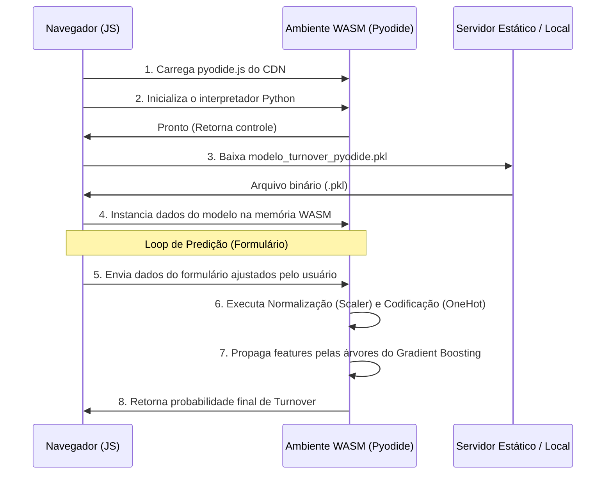

# Interface Web e Execução Local com Pyodide (WASM)

Para demonstrar a aplicabilidade prática do modelo preditivo em ambiente corporativo, o projeto conta com uma interface web interativa rica em recursos ([index.html](file:///home/gabriel-freitas-souza/Projetos/previsao-turnover-funcionarios/index.html)), que combina a exibição de relatórios analíticos dinâmicos com um simulador de propensão de turnover executando em tempo real.

---

## 🏛️ Arquitetura Client-Side (Sem Servidor)
Diferente das implementações tradicionais de Machine Learning Web — que necessitam de uma API de backend hospedada em servidores (Python com Flask, FastAPI ou Django) para receber os dados, carregar o arquivo `.pkl` pesado e retornar a previsão —, este projeto utiliza uma arquitetura **100% executada no cliente**.

Toda a lógica de pré-processamento e inferência roda diretamente dentro do navegador do usuário. Isso é viabilizado pelo **Pyodide**.

---

## 🌐 O que é o Pyodide?
O [Pyodide](https://pyodide.org/) é uma compilação do interpretador oficial do Python (CPython) para **WebAssembly (WASM)**. Ele permite que scripts Python completos, juntamente com suas bibliotecas científicas nativas escritas em C (como `numpy` e partes do `scikit-learn`), sejam executados com alto desempenho de forma nativa no navegador, isolados em uma caixa de areia (*sandbox*) de segurança.

---

## ⚡ Fluxo de Execução da Predição

Quando um usuário acessa a interface web:

### Otimização de Peso: O Exportador Pyodide
O pipeline original do Scikit-Learn salvo em [modelo_turnover.pkl](file:///home/gabriel-freitas-souza/Projetos/previsao-turnover-funcionarios/modelo_turnover.pkl) depende estritamente das classes nativas do pacote `scikit-learn`. Carregar todo o Scikit-Learn no navegador via WebAssembly exige o download de dezenas de megabytes de dados pelo usuário, gerando lentidão extrema no primeiro carregamento.

Para resolver este problema, implementamos o script [src/export_pyodide_model.py](file:///home/gabriel-freitas-souza/Projetos/previsao-turnover-funcionarios/src/export_pyodide_model.py), que realiza uma cirurgia no modelo treinado:
1. Extrai as médias e desvios padrão do `StandardScaler` como listas simples de números decimais.
2. Extrai as categorias do `OneHotEncoder` como listas de textos ordinários.
3. Desmonta a estrutura de árvores de decisão do `GradientBoostingClassifier`, salvando apenas os valores de limiares (*thresholds*), índices de atributos divididos (*features*) e valores de predição folha de cada nó.
4. Exporta tudo como um dicionário Python simples compactado em [modelo_turnover_pyodide.pkl](file:///home/gabriel-freitas-souza/Projetos/previsao-turnover-funcionarios/modelo_turnover_pyodide.pkl) (com apenas ~56 KB, contra 146 KB do modelo bruto completo).

No frontend, um script em JavaScript recria a lógica matemática dessas transformações e percorre as árvores binárias manualmente a partir desse arquivo de dicionário simplificado, garantindo previsões **idênticas** às do Scikit-Learn rodando localmente no terminal, mas com carregamento e execução instantâneos.

---

## 🎨 Funcionalidades da Interface Web

A página [index.html](file:///home/gabriel-freitas-souza/Projetos/previsao-turnover-funcionarios/index.html) é dividida em dois grandes modos de uso:

### 1. Painel de Apresentação de Resultados (Modo Slideshow)
* Apresenta os slides gerados de forma nativa na página usando componentes de apresentação ricos, permitindo navegar pelos 10 slides do projeto com animações suaves e renderização de equações matemáticas via KaTeX.
* Carrega dinamicamente o arquivo [slides/metrics.json](file:///home/gabriel-freitas-souza/Projetos/previsao-turnover-funcionarios/slides/metrics.json) para exibir as métricas de acurácia, precisão e recall sempre atualizadas de acordo com o último treino.

### 2. Formulário Preditor Interativo
* Permite ajustar em tempo real os atributos de um colaborador:
  * Nível de satisfação (Controle deslizante de 0 a 1)
  * Nota de avaliação de desempenho (Controle deslizante de 0 a 1)
  * Número de projetos alocados
  * Média de horas mensais trabalhadas
  * Tempo de casa em anos
  * Ocorrência de acidentes, promoção recente, departamento e faixa salarial.
* Ao clicar em "Prever Risco", calcula e plota um indicador de propensão:
  * **Risco Baixo (Verde)**: Probabilidade de saída < 30%
  * **Risco Moderado (Laranja)**: Probabilidade de saída entre 30% e 70%
  * **Risco Alto (Vermelho)**: Probabilidade de saída > 70%

### 3. Simulador Visual e Interativo de Algoritmos (Seção 4.1)
Esta seção é um laboratório interativo projetado para explicar didaticamente o funcionamento matemático interno de cada modelo e técnica de otimização utilizada no projeto:
* **Aba Regressão Logística**: Exibe a fronteira de decisão linear em um plano cartesiano com pontos reais de funcionários. Permite modificar os coeficientes ($w_1$, $w_2$) e o viés ($b$) por meio de controles deslizantes (sliders), visualizando como a fronteira muda de posição e projeta os pontos na função de ativação **Sigmoide** calculando métricas em tempo real.
* **Aba Random Forest**: Permite simular a classificação de um funcionário por meio de um comitê paralelo de 3 árvores de decisão. Partículas douradas animadas descem pelos caminhos das árvores simultaneamente com base nas regras de divisão lógica até registrar seus votos para a decisão final por maioria (consenso).
* **Aba Gradient Boosting**: Demonstra o ajuste sequencial de árvores fracas (*weak learners*) para prever os erros residuais do passo anterior. Permite alternar entre os passos de boosting de 0 a 3, controlar a Taxa de Aprendizado (Learning Rate $\eta$) e visualizar a redução do erro MSE em tempo real conforme as árvores corrigem os resíduos das anteriores.
* **Aba GridSearchCV + K-Fold**: Ilustra de forma animada o funcionamento da busca em grade com validação cruzada. Demonstra a divisão equilibrada das classes com o **StratifiedKFold** (proporção de 75% Fica e 25% Sai rigorosamente mantida em todos os folds) e faz uma varredura visual em cada célula da grade combinatória até encontrar a melhor configuração (max_depth=4, n_estimators=100) coroando-a como vencedora.
